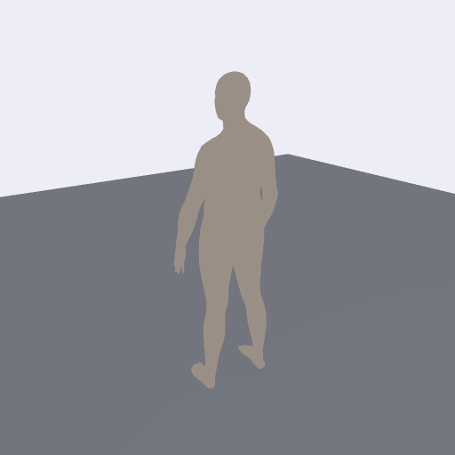
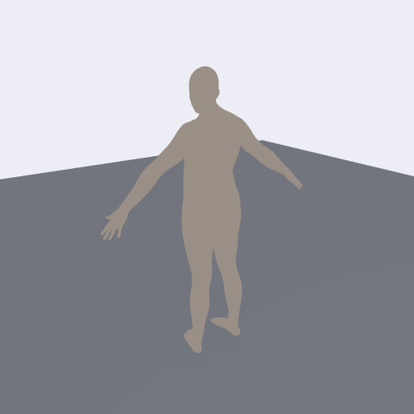
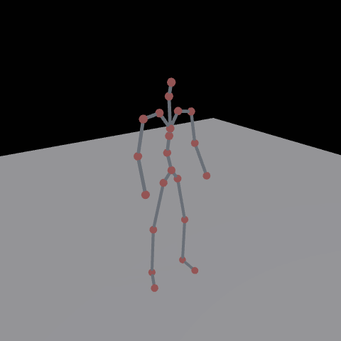
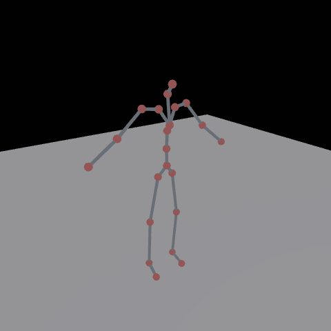

# RMG reproduction (unofficial)

My own reimplementation of RMG, "Riemannian Motion Generation: A Unified Framework for Human Motion
Representation and Generation via Riemannian Flow Matching" (Miao, Huang, Li; arXiv:2603.15016), for text
to motion on HumanML3D. The authors have not released their code, so I rebuilt the method from the paper.

I am not affiliated with the authors. The method is theirs. This repo is only a reimplementation, and any
gap from their reported numbers is on my side, not the paper's.

## Method (RMG-base, HumanML3D)

- Representation: a product manifold, R^3 for the root translation and (S^3)^22 for the 22 joint rotations
  as unit quaternions on the upper hemisphere. That comes to 91 numbers per frame. There is no dataset
  mean/std normalization; the manifold takes care of scale.
- Model: velocity Riemannian flow matching. Interpolate along geodesics, regress the tangent velocity
  Log_{x_t}(x_1)/(1-t), project the network output onto the tangent space, and integrate with a
  manifold-preserving Euler step.
- Backbone: a frame-token diffusion transformer (hidden 384, 6 layers, 8 heads, FFN x8, AdaLN).
- Text: Qwen3-Embedding-0.6B gives a 1024-d vector that is fused with the time embedding. Training uses
  classifier-free guidance (10 percent label dropout); sampling uses a guidance scale around 6.5.
- Recipe (paper Table 7): AdamW, LR 1e-4, cosine schedule with 0.08 warmup, effective batch 256,
  150k steps, gradient clip 0.5, EMA.

## Results

HumanML3D test set, official Guo evaluators, EMA weights, guidance 6.5, 1024 samples.

| metric | this repo | RMG (paper) |
|---|---|---|
| R-precision Top-3 | 0.793 | 0.805 |
| Diversity | 9.517 | 9.555 |
| MM-Dist | 3.102 | 2.930 |
| FID | 0.518 | 0.043 |

R-precision, diversity, and MM-Dist all come out within a few percent of the paper. FID is the exception,
about 0.5 against their 0.043. That gap comes from a handful of things the paper does not pin down (the
translation "canonical length", the prior covariance, the number of ODE steps), plus the fact that FID is
biased high at this sample size. The full breakdown, the paper's own table, and the baselines are in
[docs/RESULTS.md](docs/RESULTS.md); the raw numbers are in `results/metrics_humanml3d.json`.

## Repo layout

```
src/        all the Python (model, flow, data, training, eval, visualization, shared utilities)
scripts/    setup.sh (downloads), run_rmg.sh, tb.sh, watch.sh, fetch_qwen.py
data/       where the HumanML3D dataset goes (or point HML_DIR at it); downloads land here too
docs/       RESULTS.md and the build checklist
figures/    rendered GIFs (git-ignored apart from the few samples)
results/    metrics JSON
```

## Setup

```bash
pip install -r requirements.txt
bash scripts/setup.sh
```

`scripts/setup.sh` pulls the Guo evaluators and GloVe, clones the text-to-motion and HumanML3D repos, and
caches the Qwen text encoder. It prints the environment variables to export (T2M_EVAL, T2M_REPO,
HML3D_REPO). The HumanML3D dataset itself needs AMASS access and the SMPL processing pipeline, so it is not
something this script can download; see `data/README.md`. Once you have it, set `HML_DIR` to that folder.

## Commands

```bash
bash scripts/run_rmg.sh                                          # train RMG-base, writes to runs/rmg_base/
bash scripts/tb.sh                                              # TensorBoard on port 6006 (train and eval curves)
python src/rmg_eval_monitor.py --run runs/rmg_base             # log eval FID and R-precision to TensorBoard during training
python src/rmg_eval.py --ckpt runs/rmg_base/model.pth --n 1024 --guidance 6.5 --weights ema   # final eval
```

## Visualization

Everything renders from the generated joint positions, with a three-quarter camera and a ground shadow.

```bash
python src/rmg_gen_smpl.py    --ckpt runs/rmg_base/model.pth --out figures/joints.npz   # generate and export joints
python src/fit_render_mesh.py --joints figures/joints.npz --out figures                 # SMPL-X human body mesh (needs smplx)
python src/render_body.py     --joints figures/joints.npz --mode both --out figures      # capsule body or joints+skeleton, no body model
python src/render_rmg.py      --ckpt runs/rmg_base/model.pth --weights raw               # quick matplotlib stick figure
```

`fit_render_mesh.py` fits SMPL-X to the joints (the right way to do it, since HumanML3D rotations are not
SMPL pose parameters) and renders a real human body. `render_body.py` needs no body model and gives either a
capsule figure or a joints-and-skeleton figure. All of them smooth the joint trajectories over time
(`--smooth`, default 9) so the motion does not jitter; pass `--smooth 0` to turn it off.

### Samples

Text-conditioned generations, temporally smoothed. SMPL-X body mesh fit to the model's joints:

| "a person walks forward" | "a person sits down" |
|---|---|
|  |  |

Joints and skeleton, straight from the generated joints (no body model):

| "a person walks forward" | "a person sits down" |
|---|---|
|  |  |

## Notes and gotchas

A few things that cost me time and might save you some.

- Qwen pooling. Qwen3-Embedding expects last-token pooling with left padding, then an L2 normalize (see
  `src/qwen_text.py`). If you mean-pool, or right-pad and take the last position (which is then a pad token),
  the embeddings collapse to nearly the same vector for every caption and the text conditioning quietly
  stops working, with R-precision stuck at chance.
- EMA looks broken early. With decay 0.9999 the early EMA weights are still dominated by the first few
  thousand (bad) steps, so an eval on EMA partway through training reads like garbage (FID near the prior)
  even though the raw weights are fine. Monitor with `--weights raw` and only trust EMA near the end.
- HumanML3D rotations are not SMPL pose. The 263-d rotation features are recomputed per bone, not the
  original SMPL parameters, so handing them to a body model gives a near T-pose. The joint positions are
  correct, which is why the mesh viz fits SMPL-X to the joints instead of using the rotations directly.
- Things the paper leaves open that can move FID: the translation scaling, the prior covariance (I use 1.0),
  and the ODE step count (I use 100).

## Citation

If you use the method, cite the original paper:

```bibtex
@article{miao2026rmg,
  title  = {Riemannian Motion Generation: A Unified Framework for Human Motion
            Representation and Generation via Riemannian Flow Matching},
  author = {Miao, Fangran and Huang, Jian and Li, Ting},
  journal= {arXiv preprint arXiv:2603.15016},
  year   = {2026}
}
```

If this reproduction was useful, a note back to the repo is appreciated:

```bibtex
@misc{ardakanian2026rmgrepro,
  title  = {An Unofficial Reproduction of Riemannian Motion Generation (RMG)},
  author = {Ardakanian, Bardia},
  year   = {2026},
  howpublished = {\url{https://github.com/bardia-ardakanian/rmg-reproduction}}
}
```

## License

MIT. See `LICENSE`.
