# rmg reproduction (unofficial)

my own reimplementation of RMG ("Riemannian Motion Generation", arXiv:2603.15016), since the authors havent
released their code. text to motion on humanml3d. the method is theirs, i just rebuilt it from the paper, so
if a number is off thats on me, not them.

## what it is

motion lives on a product manifold: R^3 for the root translation and (S^3)^22 for the joint rotations as
unit quaternions (upper hemisphere). thats 91 numbers per frame. no dataset mean/std normalization, the
manifold takes care of scale.

the model is velocity riemannian flow matching. interpolate along geodesics, regress the tangent velocity
Log_{x_t}(x_1)/(1-t), project the network output onto the tangent space, integrate with a manifold euler
step. backbone is a frame-token diffusion transformer (384 dim, 6 layers, 8 heads, ffn x8, adaln). text is
qwen3-embedding-0.6b fused with the time embedding, trained with classifier-free guidance (10% dropout,
guidance around 6.5 at sampling).

the recipe is straight from their table 7: adamw, lr 1e-4, cosine with 0.08 warmup, effective batch 256,
150k steps, grad clip 0.5, ema.

## results

humanml3d test set, official guo evaluators, ema weights, guidance 6.5, 1024 samples:

| metric | mine | paper |
|---|---|---|
| r-precision top-3 | 0.793 | 0.805 |
| diversity | 9.517 | 9.555 |
| mm-dist | 3.102 | 2.930 |
| fid | 0.518 | 0.043 |

r-precision, diversity and mm-dist all land close to the paper. fid is the odd one out, about 0.5 vs their
0.043. short version: a few things the paper doesnt pin down (the translation "canonical length", the prior
covariance, the number of ode steps) plus fid being biased high at this sample count. the full breakdown,
their own table, and the baselines are in [docs/RESULTS.md](docs/RESULTS.md), raw numbers in
`results/metrics_humanml3d.json`.

## trained on

one rtx 5090 (driver 595.71.05, cuda 12.8) on ubuntu 24.04. conda 26.3.2, python 3.12,
torch 2.11.0+cu128. the full 150k steps took about 10.5 hours.

## layout

```
src/        all the python (model, flow, data, training, eval, viz, shared utils)
scripts/    setup.sh (downloads), run_rmg.sh, tb.sh, watch.sh, fetch_qwen.py
data/       where humanml3d goes (or point HML_DIR at it), downloads land here too
docs/       results writeup
figures/    rendered gifs (ignored apart from the samples)
results/    metrics json
web/        the interactive viewer
```

## setup

```bash
pip install -r requirements.txt
cp config.example.sh config.sh && $EDITOR config.sh   # set your data/model/cache paths here
source config.sh
bash scripts/setup.sh
```

all paths live in `config.sh` (copied from `config.example.sh`). it's gitignored on purpose, so dataset and
model locations stay out of the repo. setup.sh grabs the guo evaluators and glove, clones the text-to-motion
and humanml3d repos, and caches the qwen encoder. the humanml3d dataset itself needs amass access and the
smpl pipeline so the script cant just pull it, see `data/README.md`. point `HML_DIR` at it once you have it.

## running it

```bash
bash scripts/run_rmg.sh                                          # train, writes to runs/rmg_base/
bash scripts/tb.sh                                              # tensorboard on 6006 (train + eval curves)
python src/rmg_eval_monitor.py --run runs/rmg_base             # log eval fid/r-precision to tb while training
python src/rmg_eval.py --ckpt runs/rmg_base/model.pth --n 1024 --guidance 6.5 --weights ema   # final eval
```

## visualization

everything renders from the generated joints, 3/4 camera with a ground shadow.

```bash
python src/rmg_gen_smpl.py    --ckpt runs/rmg_base/model.pth --out figures/joints.npz \
    --prompts "a man is performing taichi movement" "a person runs for a while and then jumps with all his strength"
python src/render_robot.py    --joints figures/joints.npz --glb assets_xbot.glb --mode montage --out figures   # rigged robot + ghost trail (png)
python src/render_robot.py    --joints figures/joints.npz --glb assets_xbot.glb --mode gif     --out figures   # same, animated
python src/render_mannequin.py --joints figures/joints.npz --mode montage --out figures        # alt: smpl-x body / --body capsule
```

the body is a rigged robot mannequin (mixamo xbot, the same one the web demo uses). our model outputs smpl
joint rotations, so render_robot retargets those directions onto the robot's bones (swing-only, verified to
match the pose exactly), skins the mesh, and shows it the way the paper's figure 1 does it: a few poses
across the motion left behind as fading ghosts, zoomed out so a run tracks across the floor, prompt baked
in. `scripts/get_robot.sh` fetches the model. render_mannequin.py is the from-scratch alternative (smpl-x
body, or `--body capsule`). everything smooths the joints over time (`--smooth`, default 9).

### samples

six prompts generated in the web demo, each the robot mannequin doing the motion as a gif. just the motion,
no ghost trail, a colour per motion and the prompt baked in:

| | | |
|---|---|---|
| 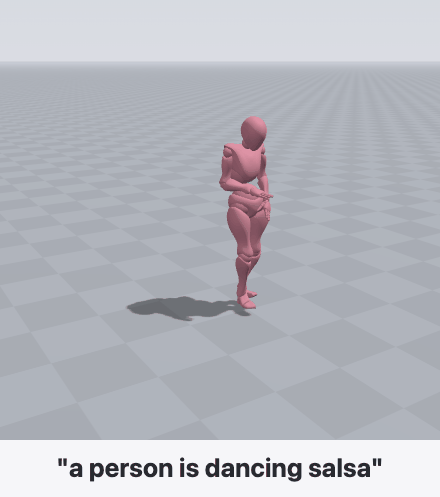 |  | 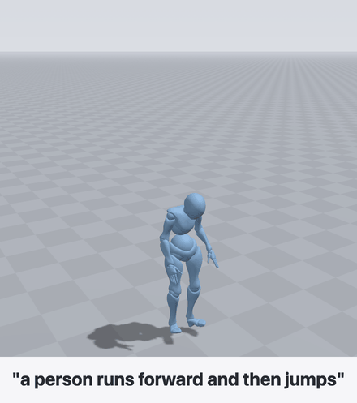 |
| 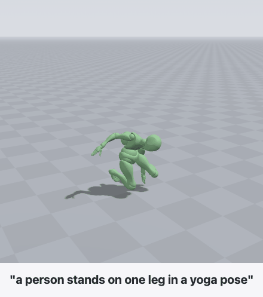 | 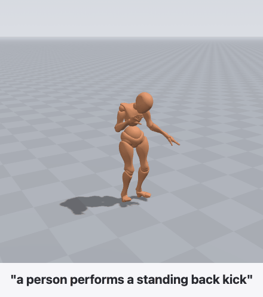 | 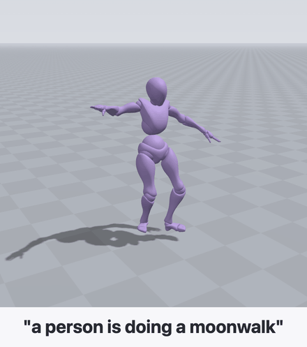 |

the same model output drives a bare skeleton instead if you flip the demo's "skeleton" toggle, here for three
of them:

| | | |
|---|---|---|
| 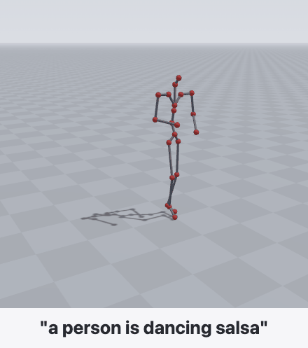 | 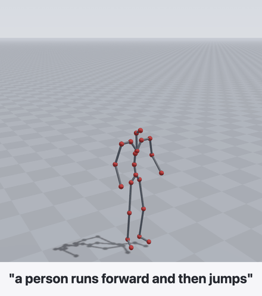 | 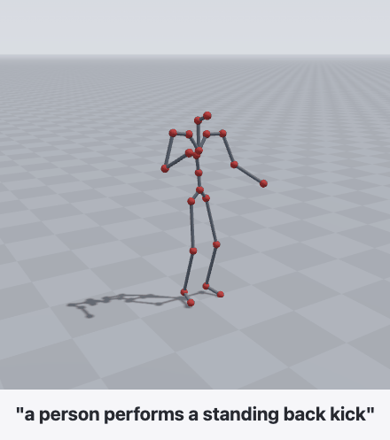 |

## web demo

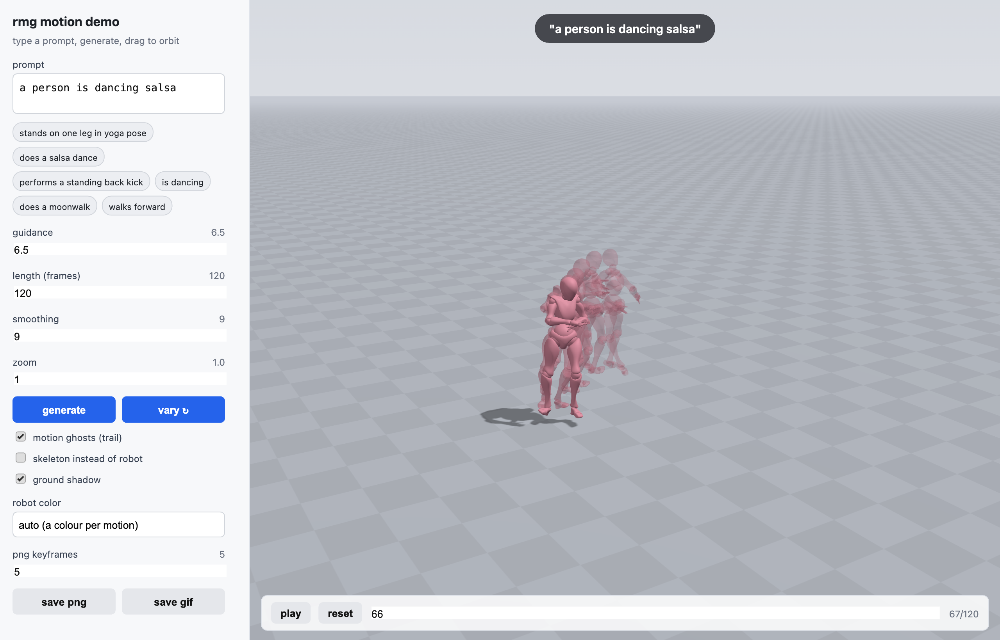

theres an interactive viewer too. type a prompt (or hit one of the example chips), it generates on whatever
machine runs the server, and the browser drives the rigged robot mannequin in 3d (or a bare skeleton if you
flip the toggle). orbit with the mouse, play/scrub, pick a body colour per motion, toggle the ground shadow
and the motion-ghost trail, and set how many keyframes the png export uses.

two exports. "save gif" writes the animation (the samples above). "save png" instead snapshots the pose at
evenly spaced keyframes and lays them out left to right, one picture per keyframe:

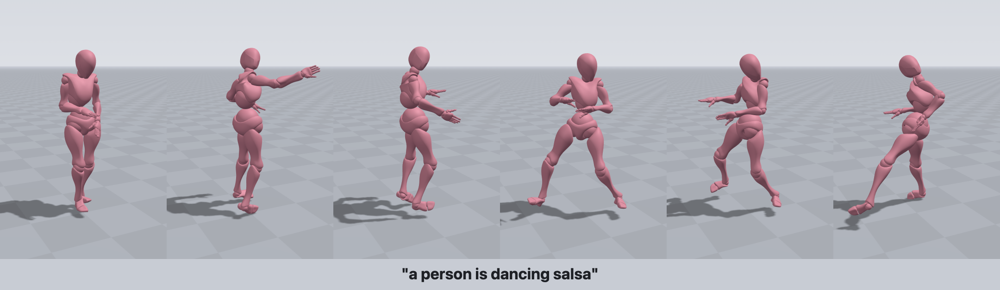

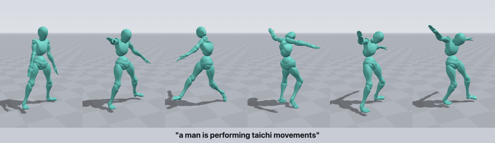

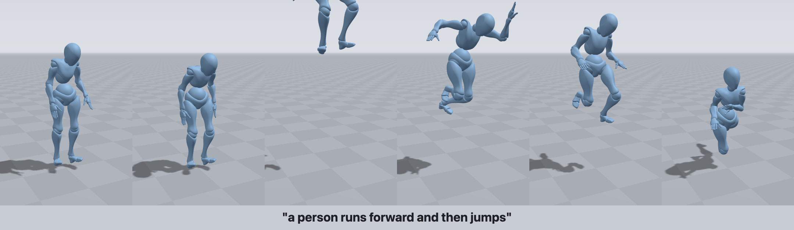

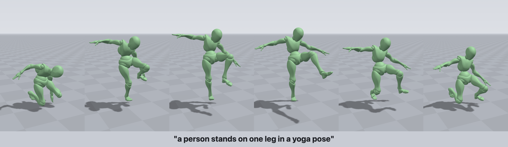

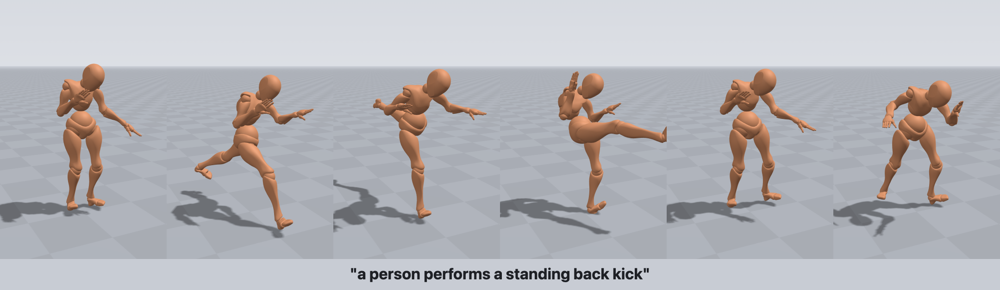

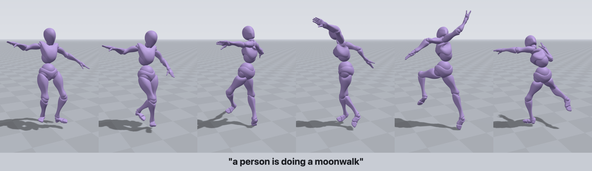

```bash
python web/app.py        # port 8000
```

if its running on a remote box, tunnel the port and open it locally:

```bash
ssh -L 8000:localhost:8000 <host>
# then open http://localhost:8000
```

set `RMG_CKPT` if your checkpoint isnt at `runs/rmg_base/model.pth`.

## motionmillion (scaling up)

same model, same method, just trained on motionmillion instead of humanml3d to see if it holds up at
scale. the released part of motionmillion is about 458k clips of motion (rpr272 format, 30fps) which is
roughly 20x humanml3d. i didnt touch the model at all. all i wrote is an adapter that turns the 272-dim
rpr272 vectors into the representation rmg already uses (root translation + 22 joint quaternions) and a
lazy dataloader so the whole set doesnt have to sit in memory.

the rpr272 rotations are actually nicer to work with than humanml3d's: they're proper local smpl-x style
rotations, so no smpl-x refitting needed for the body mesh. the decode in `src/mm_data.py` is a faithful
port of motionmillion's `recover_from_local_rotation`. captions are llm-written (about 20 per clip), they
sit packed in `texts.tar.gz` so `mm_prep.py` streams the tar instead of unpacking 1.5M tiny files, and
the qwen embeddings get precomputed once into a memmap.

the dataset is gated, request access on huggingface (`VankouF/MotionMillion`). point `MM_ROOT` at it in
`config.sh` (copy `config.example.sh` and fill in your paths; config.sh is gitignored so machine paths stay
out of the repo). trained on one rtx 5090 (32gb).

```bash
cp config.example.sh config.sh && $EDITOR config.sh   # set MM_ROOT / MM_META / HF_HOME for your machine
source config.sh
bash scripts/mm_setup.sh        # extract the split lists, sanity-check the dataset
bash scripts/mm_prep.sh         # clip index + qwen caption embeddings -> cache/mm_train_*
bash scripts/run_rmg_mm.sh      # train -> runs/rmg_mm   (STEPS / BATCH / ACCUM / WORKERS overridable)
bash scripts/tb.sh              # tensorboard on 6006
```

## stuff i ran into

- qwen pooling. qwen3-embedding wants last-token pooling with left padding, then an l2 normalize (see
  `src/qwen_text.py`). if you mean-pool, or right-pad and grab the last position (which is then a pad token),
  the embeddings basically collapse to the same vector for every caption and the text conditioning quietly
  dies, r-precision sits at chance. took me a while to spot.
- ema looks broken early. with decay 0.9999 the early ema weights are still dominated by the first few
  thousand bad steps, so evaluating ema partway through reads like garbage (fid near the prior) even though
  the raw weights are fine. monitor with `--weights raw` and switch to ema near the end.
- humanml3d rotations arent smpl pose. the 263-d rotations are recomputed per bone, not the original smpl
  params, so handing them to a body model gives a near t-pose. the joints are fine though, which is why the
  mesh viz fits smpl-x to the joints instead of using the rotations directly.
- things the paper leaves open that move fid: the translation scaling, the prior covariance (i used 1.0),
  and the ode step count (i used 100).

## citation

if you use the method, cite the original paper:

```bibtex
@article{miao2026rmg,
  title  = {Riemannian Motion Generation: A Unified Framework for Human Motion
            Representation and Generation via Riemannian Flow Matching},
  author = {Miao, Fangran and Huang, Jian and Li, Ting},
  journal= {arXiv preprint arXiv:2603.15016},
  year   = {2026}
}
```

if this repo helped, a link back is appreciated:

```bibtex
@misc{ardakanian2026rmgrepro,
  title  = {An Unofficial Reproduction of Riemannian Motion Generation (RMG)},
  author = {Ardakanian, Bardia},
  year   = {2026},
  howpublished = {\url{https://github.com/bardia-ardakanian/rmg-reproduction}}
}
```

## license

MIT, see `LICENSE`.
